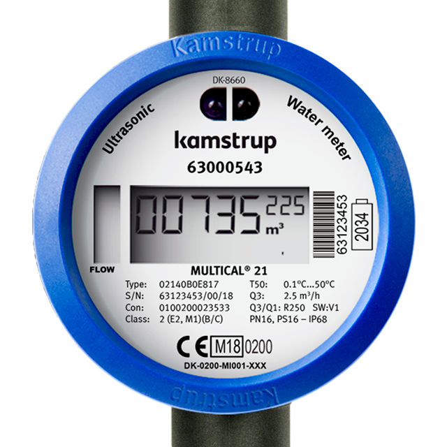

# Kamstrup Multical 21 water meter in Home Assistant (Wireless MBus)



### Features

- Configuration ready for Home Assistan with MQTT.
- Support for AES-128 decryption (with vaild key).
- CRC Check of recived data.
- Wireless reading of data.
- Easy to build and configure.

### Parts

Use these arfilliate links to support me!\
[CC1101 Module](https://s.click.aliexpress.com/e/_DembjFr) \
[ESP32 DevKit](https://s.click.aliexpress.com/e/_mPgipQY) \
Some cables

### Wiring

| CC1101 | ESP32         |
| ------ | ------------- |
| VCC    | 3V3           |
| GND    | GND           |
| CSN    | P4            |
| MOSI   | P23           |
| MISO   | P19           |
| SCK    | P18           |
| GD0    | P32           |
| GD2    | Not Connected |

 

### Build and Upload Firmware

- Make sure you have a decryption key for your meter (you need to ask your water service provider for it).
- Read the serial number on the meter (typically S/N: XXXXXXXX/A/20, the serial number is the XXXXXXXXX part).
- Rename credentials_template.h to credentials.h and add your details.
- Compile and upload:
  - You need [VS Code](https://code.visualstudio.com/) and the [PIO Plugin](https://platformio.org/)
  - Open the project folder with the platformio.ini file (File -> Open Folder...), connect the ESP32 via USB then build and upload with Ctrl+Alt+U.

### Home Assistant

Setup [MQTT](https://www.home-assistant.io/integrations/mqtt/) if you don't already have it.

Add this to configuration.yaml

```
mqtt:
  sensor:
    - name: "Water Meter Usage"
      state_topic: "watermeter/0/sensor/mydatajson"
      unit_of_measurement: "m³"
      value_template: "{{ value_json.CurrentValue }}"
      device_class: water
      state_class: total_increasing
      availability:
        - topic: "watermeter/0/online"
          payload_available: "True"
          payload_not_available: "False"
    - name: "Water Meter Month Start Value"
      state_topic: "watermeter/0/sensor/mydatajson"
      unit_of_measurement: "m³"
      value_template: "{{ value_json.MonthStartValue }}"
      device_class: water
      state_class: total_increasing
    - name: "Water Meter Room Temperature"
      state_topic: "watermeter/0/sensor/mydatajson"
      value_template: "{{ value_json.RoomTemp }}"
      unit_of_measurement: "°C"
    - name: "Water Meter Water Temperature"
      state_topic: "watermeter/0/sensor/mydatajson"
      value_template: "{{ value_json.WaterTemp }}"
      unit_of_measurement: "°C"
```

This is a based on [chester4444/esp-multical21](https://github.com/chester4444/esp-multical21).
Thanks to chester4444for his effort.

## Home Assistant

### Discovery payload

https://www.home-assistant.io/integrations/mqtt#discovery-topic

Format: `<discovery_prefix>/<component>/[<node_id>/]<object_id>/config`

```
  homeassistant/sensor/<meterId>/volume/config
  homeassistant/sensor/<meterId>/target/config
  homeassistant/sensor/<meterId>/temperature/config
  homeassistant/sensor/<meterId>/ambient_temperature/config
```

Value example:

```json
// homeassistant/sensor/0x00158d0002b6fba7/temperature/config

{
  "availability": [
    {
      "topic": "zigbee2mqtt/bridge/state",
      "value_template": "{{ value_json.state }}"
    }
  ],
  "device": {
    "identifiers": ["zigbee2mqtt_0x00158d0002b6fba7"],
    "manufacturer": "Xiaomi",
    "model": "MiJia temperature & humidity sensor (WSDCGQ01LM)",
    "name": "th-sensor-living-room-2",
    "sw_version": "3000-0001"
  },
  "device_class": "temperature",
  "enabled_by_default": true,
  "name": "th-sensor-living-room-2 temperature",
  "state_class": "measurement",
  "state_topic": "zigbee2mqtt/th-sensor-living-room-2",
  "unique_id": "0x00158d0002b6fba7_temperature_zigbee2mqtt",
  "unit_of_measurement": "°C",
  "value_template": "{{ value_json.temperature }}"
}
```

Example 2:

```json
// https://www.home-assistant.io/integrations/mqtt#sensors

{
  "device_class": "temperature",
  "state_topic": "homeassistant/sensor/sensorBedroom/state",
  "unit_of_measurement": "°C",
  "value_template": "{{ value_json.temperature}}",
  "unique_id": "temp01ae",
  "device": {
    "identifiers": ["bedroom01ae"],
    "name": "Bedroom"
  }
}
```

```json
{
  "name": "My Super Device",
  "object_id": "my_super_device",
  "state_topic": "homeassistant/sensor/device1/state"
}
```

#### Config common

```json
{
  "availability": [
    {
      "topic": "water-meter/0x57593016/state",
      "value_template": "{{ value_json.state }}"
    }
  ],
  "device": {
    "identifiers": ["mc21"],
    "manufacturer": "Kamstrup",
    "model": "Multical 21",
    "name": "water-meter"
  },

  ...
}
```

#### Volume

```json
// homeassistant/sensor/0x57593016/volume/config

{
  ...common,

  "device_class": "water",
  "enabled_by_default": true,
  "name": "water-meter volume",
  "state_class": "measurement",
  "state_topic": "water-meter/0x57593016/sensor/state",
  "unique_id": "0x57593016_volume",
  "unit_of_measurement": "m³",
  "value_template": "{{ value_json.volume }}"
}
```

#### Target

```json
// homeassistant/sensor/0x57593016/target/config

{
  ...common,

  "device_class": "water",
  "enabled_by_default": true,
  "name": "water-meter target",
  "state_class": "total",
  "state_topic": "water-meter/0x57593016/sensor/state",
  "unique_id": "0x57593016_target",
  "unit_of_measurement": "m³",
  "value_template": "{{ value_json.target }}"
}
```

#### Temperature

```json
// homeassistant/sensor/0x57593016/temperature/config

{
  ...common,

  "device_class": "temperature",
  "enabled_by_default": true,
  "name": "water-meter temperature",
  "state_class": "measurement",
  "state_topic": "water-meter/0x57593016/sensor/state",
  "unique_id": "0x57593016_temperature",
  "unit_of_measurement": "°C",
  "value_template": "{{ value_json.temperature }}"
}
```

#### Ambient Temperature

```json
// homeassistant/sensor/0x57593016/ambient_temperature/config

{
  ...common,

  "device_class": "temperature",
  "enabled_by_default": true,
  "name": "water-meter ambient temperature",
  "state_class": "measurement",
  "state_topic": "water-meter/0x57593016/sensor/state",
  "unique_id": "0x57593016_ambient_temperature",
  "unit_of_measurement": "°C",
  "value_template": "{{ value_json.ambient_temperature }}"
}
```

#### Sensor state

```json
// water-meter/0x57593016/sensor/state

{
  volume: <number>,
  target: <number>,
  temperature: <number>,
  ambient_temperature: <number>
}
```
